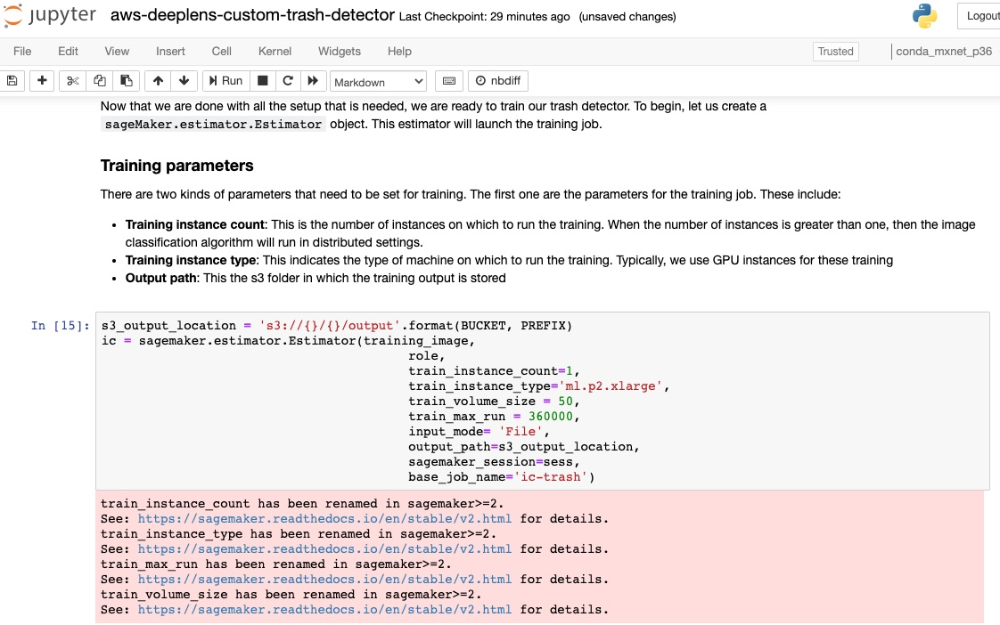
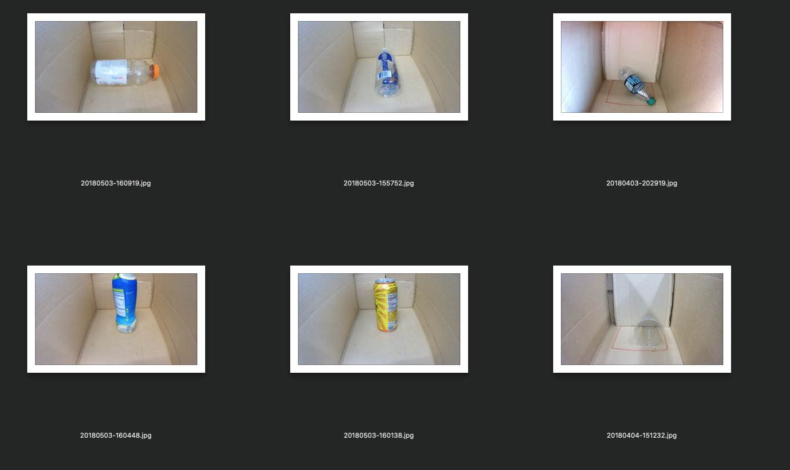
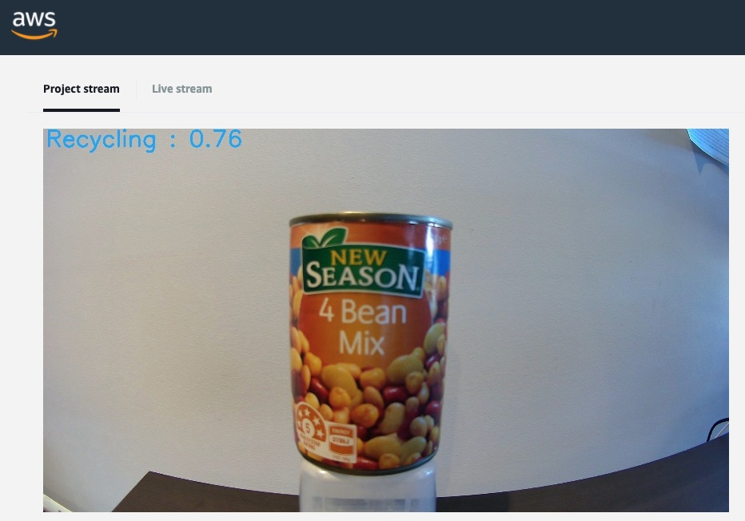
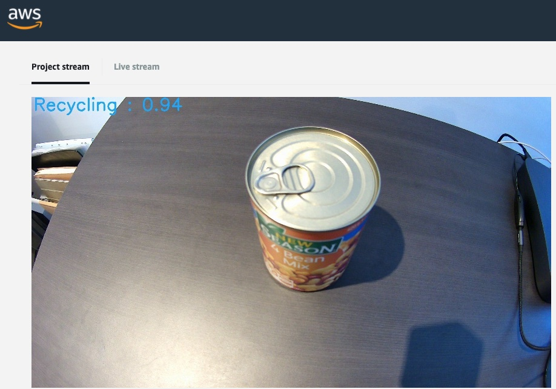

# What we all came here for... SageMaker!
I was excited to get stuck into [the Advanced recipe - Build a custom ML model to sort trash](https://www.awsdeeplens.recipes/400_advanced/410_trash_sorter/) as this started getting into the parts I wanted to know more about; how to get a basic model trained in SageMaker and then deploy it to the DeepLens device.

# Step 1 - Train!
Luckily in this example they include a number of sample images, quite a decent set really with over 500 images in total, seperate into Compost, Landfill and Recycling.

To train the model they ask that you place a service limit increase, which is something I have never needed to do outside of a work context. Living on the edge!

Unfortunately these instructions do follow a similar pattern to my previous attempt, where there we a number of the sections involve commands where the SageMaker interface has changed. I ended up squeezing through with thankful backwards compatibility, allowing me to execute outdated commands.

Luck was not with me everywhere though; when testing a set of images against the newly created SageMaker endpoint the provided Jupiter notebook commands were now unable to be executed against due to interface changes.

Luckily a quick search resulted in finding this repo [ZacksAmber/Trash-Sorter](https://github.com/ZacksAmber/Trash-Sorter/), where an updated version of the notebook contains changes to the non-working commands. This allowed me to slide through until the end. Thank you internet stranger!

# Step 2 - Deploy, now from SageMaker itself
Like previously, we can now shift gears back to the DeepLens device to deploy our model. This time however, instead of deploying the static model from a S3 bucket, we can now reference a 'Amazon SageMaker training job name' to supply our training model!

---

# The answer we all want to know; does it work?
Well, yes. It's not magic but it does work if you create a favourable environment similar to your input data environment.
Looking at the input images I noticed a lot of the images were taken from an angle, somewhat top down.

So, what happens when you place a can of beans down and point the camera directly at it?

Eh, it's correct but it's not *sure* it's recycling, which is not what we want.

Now, say we take the camera angle into account this time and point the camera at the can in a similar fashion to our training data?

**WE HAVE A MATCH!**

# Lesson Learnt
For myself the biggest take away was that the environment in which the training data was captured can effect how the model will interpret the field data later on. Seems obvious in hindsight, however I was confused why topdown angles were yielding the best results at first. This was until I checked out the training images and then it all made sense.

Also, for the record, apparently my phone is compost and my left hand is landfill. Who knew?
