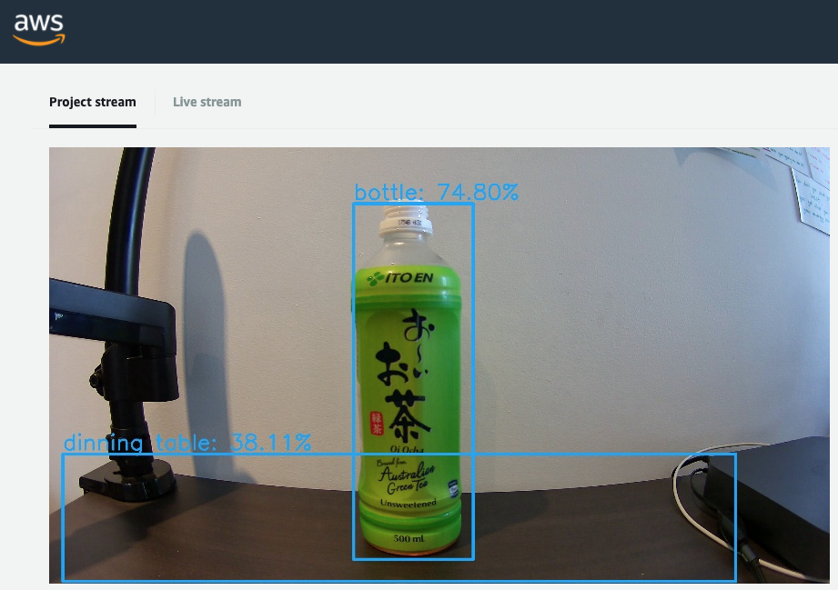
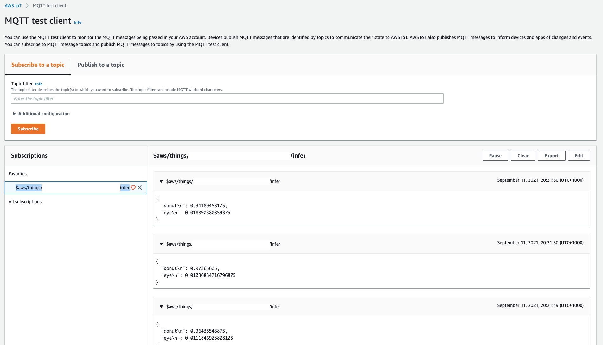
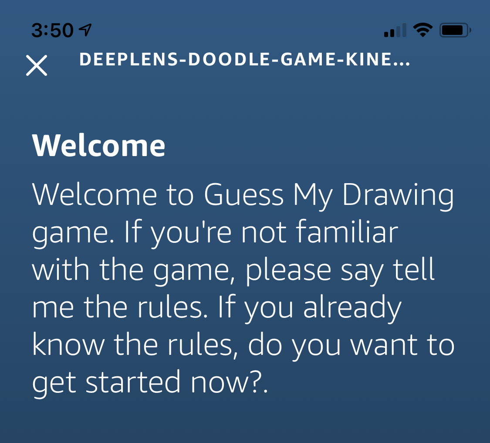
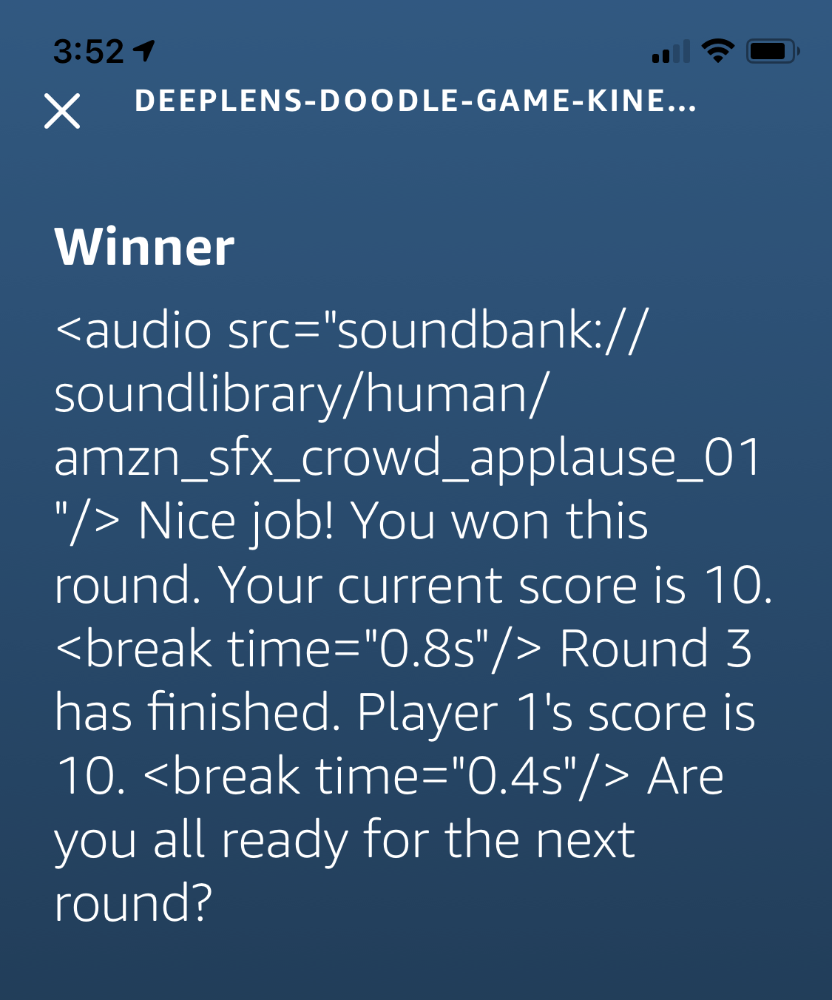
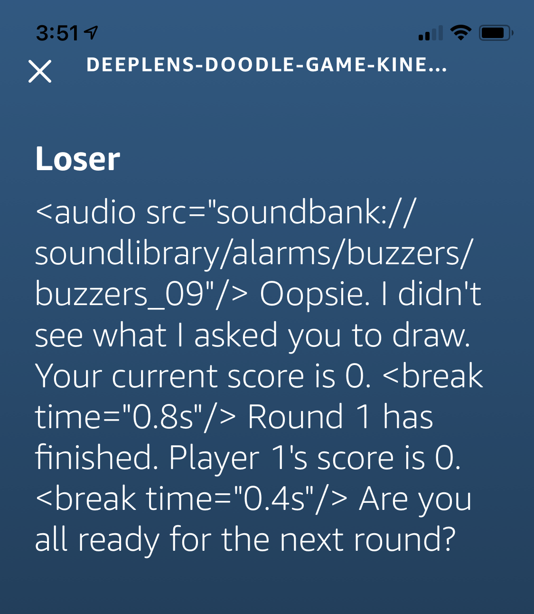

# Beginnings start here!

Hello all and welcome to my first article around my attempts to create an Amazon SageMaker-based solution, focusing on image detection.

I am participating in an initiative as part of my company's AWS Community of Practice. The idea is inspired loosely by [A Cloud Guru's How to Build a Netflix Style Recommendation Engine with Amazon SageMaker Challenge](https://acloudguru.com/blog/engineering/how-to-build-a-netflix-style-recommendation-engine-with-amazon-sagemaker) and I have got my hands on a AWS DeepLens so I'm going to see what I can do with both of these to the best of my ability!

## Setup - Resurrect the DeepLens!

I was given a AWS DeepLens in a sad state earlier this year with a goal - get the thing working again. On inspection it appeared someone had done something pretty horrific to it and installed a non-Deep Lens Ubuntu distribution on it. Or at least, they tried and failed terribly. I was luckily able to get my hands on a Factory Restore image for my 1.0 version and restore it to its former glory - of functioning!

## Trial 1 - The Fated AWS Example
Initially I tried out using one of the AWS examples -  [amazon-sagemaker-object-detection-from-scratch](https://github.com/aws-samples/amazon-sagemaker-object-detection-from-scratch).

This repo suffered from a common theme in this series - it was only written a mere two years ago and yet is already showing significant signs of ageing through the use of Python 2. It amazes me how fast these ecosystems are transforming sometimes - two years is a long time in the Python world it appears.

I could not get this solution to deploy correctly no matter what I did. When running trigger_app.py I could not get past a timeout issue - I suspect a network connection was being blocked, somewhere, at some level. I wasn't willing to debug any further so I shifted focus and moved onto something different -  [a AWS DeepLens Recipe](https://www.awsdeeplens.recipes/)!

## Trial 2 - Cooking with AWS
With a renewed focus on figuring out how to interact correctly with the AWS DeepLens itself first I decide just to do [the most basic AWS DeepLens example - Object Detection](https://www.awsdeeplens.recipes/200_beginner/210_deploy_a_sample_project/)! This should be pretty easy right..?

Deploying the project itself isn't too hard, as you would hope for a Beginner example. You pretty much just had to deploy the detection framework to the DeepLens and let it do its thing. Plug-n-Play at it's finest.

Ito-En is certified bottle-like to a relatively high percentage! It was a relief to see it was working and that I could now connect and get an output from the device.

It was time to turn things up and move onto to the next step - attempting an *Intermediate* example.

## Trial 3 - Pictionary with Alexa - What could go wrong?
I chose the [Building a Pictionary-style game with AWS DeepLens](https://www.awsdeeplens.recipes/300_intermediate/330_guess_drawing/) example as I'm hoping to involve text detection in my future solution, so drawing detection was right up my lane. This solution also involved a number of services - Lambda, Kinesis Data Streams, DeepLens, IoT and most interestingly... Alexa.

The first step was probably the most problematic step - creating a Lambda function that used Python 2.7. As 2.7 is now a depreciated Lambda running environment in AWS you can no longer create these from the AWS Management Console. You can, however, repurpose existing Lambda functions that are using this depreciated Python version for new purposes. Luckily my failed initial trial ran a AWS CloudFormation template that created one of these Python 2.7 Lambda functions so I ripped out the insides of that function and repurposed it for this function.
Best practise architects are probably throwing their hands up in dismay but I am not going to rewrite every piece of Python 2 to 3 every time I come across something that's written in Python 2. I still don't fully understand the differences myself so the task is not something I am ready for... just yet.

Setting up the Kinesis Data Stream was interesting - I have studied Kinesis to death over the last few years but I've never actually used it in something practical - certification examples do not count here. In this solution, however, we're streaming the results computed on the DeepLens device via a AWS IoT MQTT queue through to the Kinesis Data Streams. Seeing the messages come through on the CloudWatch dashboard was cool once I got the solution running, and helpful in the end as I named my stream incorrectly and had to clarrify if anything was actually getting sent through.

Next was facing off with Alexa - a fiend I had never even used myself previously, let alone logged into into the web interface.
Setup was relatively easy, if not a bit confusing. It suffers from the old Amazon or AWS log in confusion - I was bashing away with my AWS credentials when it actually required my Amazon credentials. The interface is also a different beast to attend to - not bad, but definitely not AWS.

I created a new Skill, dumped in the JSON examples to setup my Intents and pointed it to my ye olde Python 2.7 Lambda function. Upon building the Skill I was then able to test it out and... it didn't work. I had misnamed my Kinesis Data Stream which resulted in my Lambda function being unable to find a shard for a 'RawDataStream' stream, returning null to Alexa. Initially a bit of a downer but once fixed we had a working skill!

Playing the game it will ask you to draw something from a predetermined list of objects in 4 seconds (news flash - I was unable to draw something in 4 seconds... but it waits for you to reply so not all was lost).
Looking at the DeepLens Project Output it will detect what you've drawn and send the guess via the IoT MQTT queue to the Kinesis Data Stream. When you tell Alexa you're finished drawing it will invoke your Lambda function, which itself pulls data stored in your Kinesis Data Stream and inspects what your DeepLens suspected your drawing was of - if it matches up with what was asked you win!

If it doesn't match up... well, you lose this round.

# And forward, on to the next... an Advanced recipe!
Overall this process has been pretty enjoyable and all up I'm still sitting at $0.02 in my AWS Account. I'm not sure if the costs have actually come through yet but for a cost of 2c I'm pretty happy.
Next up is moving onto the Advanced recipe - the  [DeepLens Trash Classiffication Recipe](https://www.awsdeeplens.recipes/400_advanced/410_trash_sorter/). This will involve Amazon SageMaker, which is ultimately what I'm here for. I'm pumped to see this in action!
