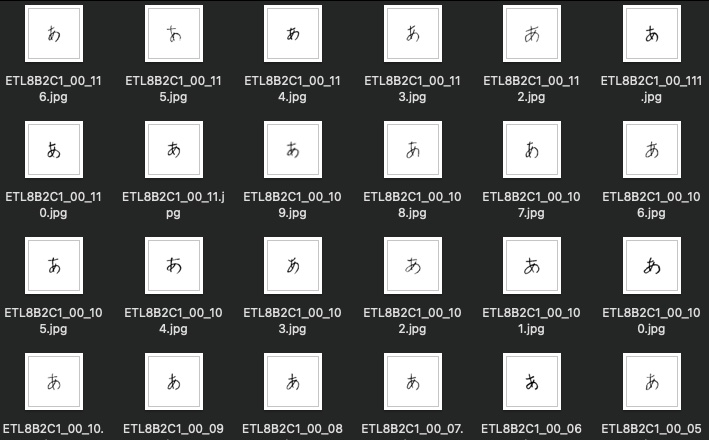
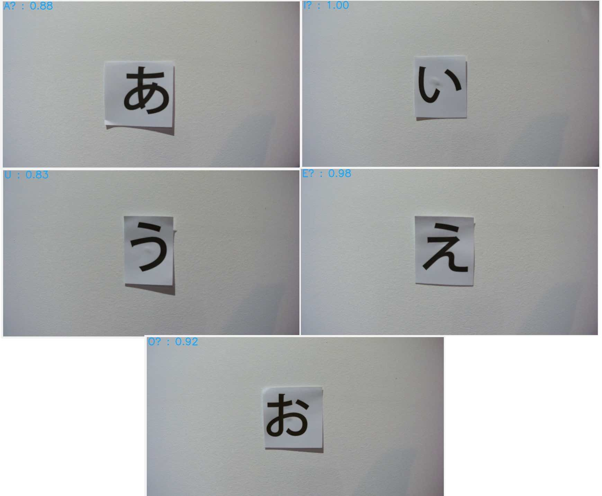
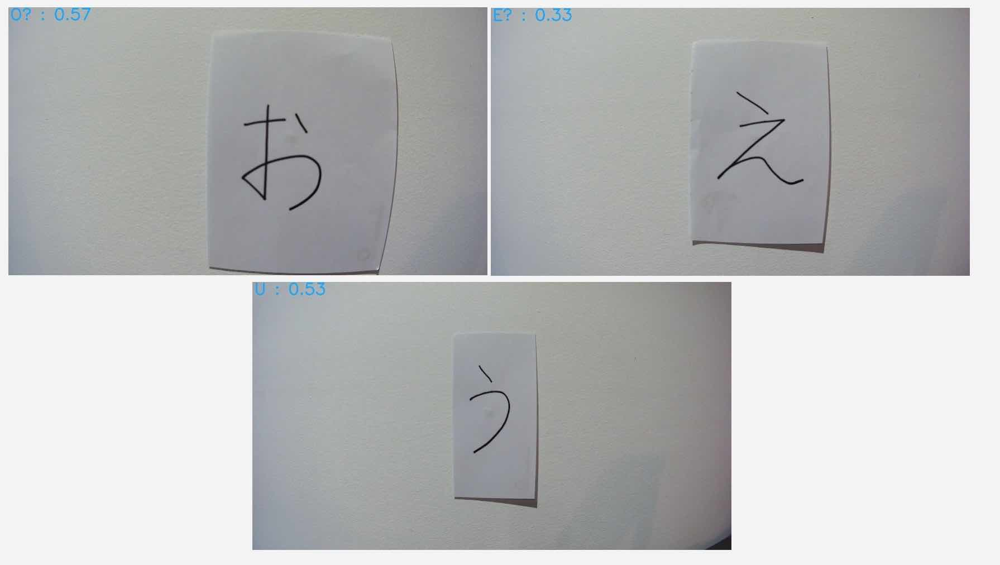

Starting last week I felt like I was ready to jump into attempting to work off the knowledge I had built up doing the examples previously and attempt the main goal; to create a model that was capable of recognising some of the Japanese Hiragana character set.

# Problem - Input Data!

My initial problem that I had been playing with was the idea of a training data set - where would I get a good set of training data from?

Luckily this was no where near as significant a problem as I had perceived it to be. The  [ETL Character Database](http://etlcdb.db.aist.go.jp/) is database of 1.2 billion characters - numerals, symbols, alphabetic and... Japanese characters! The database I needed access to was the eighth database, ETL-8, which contained many written examples of the hiragana character set.

I was concentrating on the first 5 characters of the Hiragana character set - あいうえお, or rather A I U E O. You may recognise these as they are there the exact same set of characters we use in English as vowels, just in a different order.
These characters presented a good challenge as there are similar looking characters in the mix, like う/U and え/E. These look somewhat similar, similar enough it could confuse a trained model... potentially.

In total this dataset provided me with 160 images per character, so a total of 800 images - an amazing dataset for something I previously had no idea how to solve!

# Solution - Train the model!

With my input dataset issues solved I set off to train a model to use this dataset.

Initially I was going to search for the most appropriate model to use and research if there were character-orientated recognition models already out there but then the idea hit me - characters like hiragana are drawings essentially. Why not just use the model from the [Building a Pictionary-style game with AWS DeepLens](https://www.awsdeeplens.recipes/300_intermediate/330_guess_drawing/) example I did previously and change the training dataset?

So instead of going for all out perfection first round I did just the above. I created a new Jupyter notebook, transferred the required parts over to this new notebook and after failing multiple times due to menial syntactical mistakes I reach the point of testing the model I had created - with good results!

The excluded testing dataset passed with very high confidence! Things were looking great so far.

# The real test has arrived - will a AWS DeeLens deployed model work as well as it did in testing?

Deploying a functioning Lambda function to work with the AWS IoT output the AWS DeepLens was producing proved difficult beyond logic and is still unsolved - for some reason I cannot get any function that is using Python 3 (in particular the supported Python 3.7) to work. More on this another day, however long story short I reverted back to using Python 2.7 and strived to move forward with my depreciated runtime!

I printed out a computer-generated set of A I U E O to post up on my wall to test my model. Below are the results;

For a model trained with a pretty vanilla setup these are impressive results!
Admittedly the above results are for perfectly shaped computer-generated characters.

When I use my own human-written characters the results are not as amazing. Still correct, but with a much lower level of confidence;

# Next Steps!

Whilst this was a successful attempt and I'm happy with the results many improvements could be made;
1. All ELT Database character data is scanned from paper and is therefore presented facing straight at the character, so to speak. It's like we're looking straight forward at the characters. This bias presents itself when using the AWS DeepLens - predictions are great when the camera is faced directly towards the character in question. When the camera moves slightly to the left or right however accuracy falls off quickly.
Discovering how to overcome this weakness in my dataset will be interesting!
2. I am currently using the same model as the Pictionary example; a image classification model. I am still wondering if there's a more appropriate model out there.
3. Python 3 is the bane of my existence when using the AWS DeepLens. Will I be able to overcome the compatibility issues? Time will tell!
